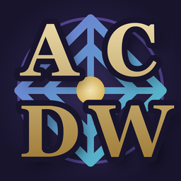

# DreamweaveMarket
## Download

**[Download the latest release](https://github.com/ExplicitLab/DreamWeaveMarket/releases/latest)**

Unzip somewhere permanent, then add the `DreamweaveMarket-<version>.dll` through the
Decal Agent's **Plugins > Add**. Instructions are in `INSTALL.txt` inside the zip.

-

A Decal plugin for Asheron's Call that shows <https://market.acdreamweave.com> either **inside the
game** or in a pop-out window on top of it, or a quick access button to load your default browser and load the page

| Mode | What it does |
|---|---|
| **In Game** (default) | drawn on the Market page, inside the plugin's Virindi window |
| **Pop Out Window** | a separate desktop window floating over the client |

Pick one with the checkboxes on the Settings page,The choice is remembered in `settings.txt`.

## Requirements

- Decal 3.0 and Virindi View Service (VVS is what draws the window and the bar; without it the
  plugin still loads and the chat commands still work, using a plain Decal view instead).
- The Microsoft Edge WebView2 Runtime, for the browser itself. It is already on up-to-date
  Windows 10/11; otherwise get the Evergreen runtime from
  <https://developer.microsoft.com/microsoft-edge/webview2/>.
- Run AC windowed or borderless. The market window sits on top of the client, which exclusive
  fullscreen does not allow.

## Building

Run `build.bat`. It locates Visual Studio's MSBuild, restores the WebView2 package, builds
Release/x86, and packages the result:

    build.bat                   build Release
    build.bat Debug             build Debug
    build.bat Release 1.0.5     set the version to 1.0.5 first, then build

### Reference assemblies

The project compiles against four assemblies that are **not in this repository** - they belong to
Decal and to Virindi, and redistributing them is not this project's to do:

    Decal.Adapter.dll
    Decal.Interop.Core.dll
    Decal.Interop.Inject.dll
    VirindiViewService.dll

## Licence

MIT - see `LICENSE`. This covers this project's own code only, not the Decal or Virindi
assemblies it builds against.

## Credits

Designed by Rez (mostly Claude). Feedback and bug reports: the AC:DW Discord.
